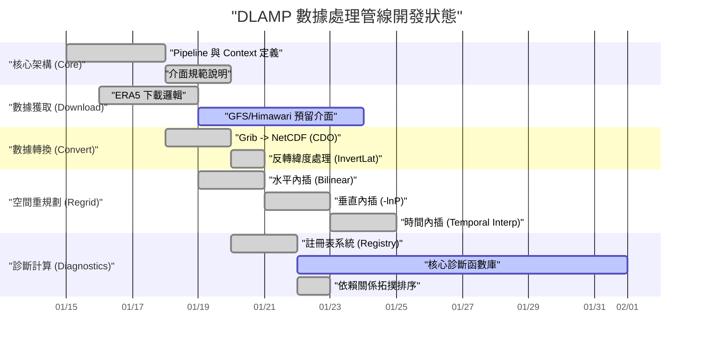
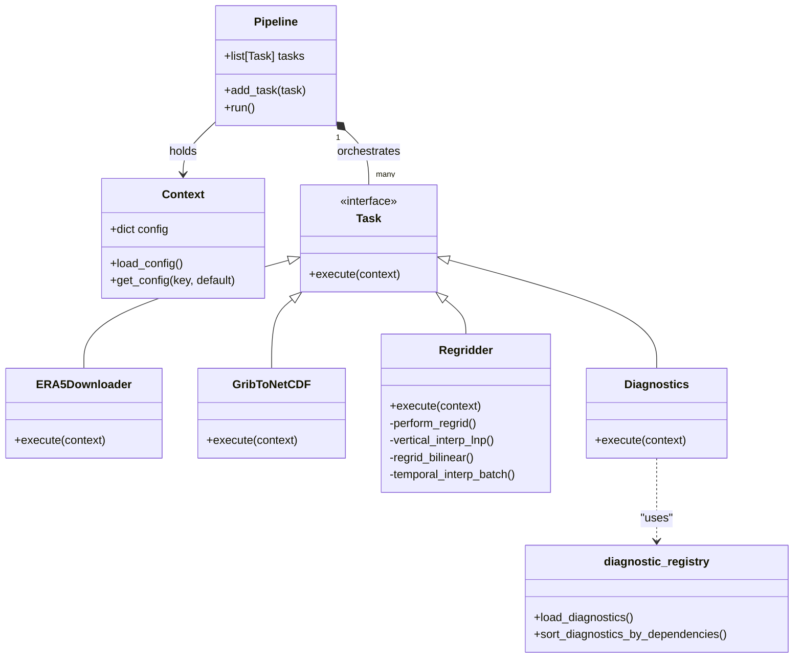

# BMDS 專案 OOP 結構與介面定義文件

本文檔詳細紀錄了目前專案中 `src/core`、`src/tasks` 與 `src/registry` 的物件導向 (OOP) 結構、介面定義以及專案開發進度概況。

---

## 1. OOP 結構與介面定義

### A. 核心架構 (`src/core`)

核心單元負責管線 (Pipeline) 的編排與狀態管理，確保任務間的低耦合與高擴展性。

| 類別 / 模組 | 描述 | 主要介面 / 屬性 |
| :--- | :--- | :--- |
| **`Context`** (`context.py`) | 存放 Pipeline 執行期間的共享狀態與配置。 | `config_path`: 配置路徑; `config`: 配置內容字典; `load_config()`: 載入 YAML 配置; `get_config(key)`: 獲取配置值 |
| **`Task`** (`pipeline.py`) | 所有任務的抽象基類 (ABC)。 | `execute(context: Context)`: 抽象方法，定義任務執行邏輯。 |
| **`Pipeline`** (`pipeline.py`) | 負責按順序執行任務的編排器。 | `tasks`: 任務列表; `add_task(task: Task)`: 加入任務; `run()`: 循序執行所有任務 |

### B. 任務層 (`src/tasks`)

具體的作業邏輯封裝在繼承自 `Task` 的各類別中。

- **`ERA5Downloader`** (`download.py`):
  - 繼承 `BaseDownloader` -> `Task`。
  - 負責與 CDS API 交互，下載 ERA5 `surface` 與 `pressure_level` 資料。
  - 實作合併 (Merge) 多個 GRIB 檔案的功能。
- **`GribToNetCDF`** (`convert.py`):
  - 繼承 `BaseConverter` -> `Task`。
  - 利用 CDO 工具將 GRIB 格式轉換為 NetCDF4。
  - 包含 `invertlat` 處理以校正座標方向。
- **`Regridder`** (`regrid.py`):
  - 繼承 `Task`。
  - 核心功能：水平內插 (Bilinear)、垂直內插 (-lnP 空間) 以及時間內插 (Temporal Interpolation)。
  - 提供裁切 (Crop) 優化以提升處理效率。
- **`Diagnostics`** (`diagnostics.py`):
  - 繼承 `Task`。
  - 負責根據註冊表計算各種氣象診斷變數。
  - 處理變數間的依賴關係排序 (Dependency Sorting)。

### C. 註冊表層 (`src/registry`)

定義診斷變數的邏輯與查找機制。

- **`diagnostic_registry.py`**:
  - `load_diagnostics(yaml_path)`: 解析配置並動態載入對應的函數。
  - `sort_diagnostics_by_dependencies(diagnostics)`: 使用 DFS 算法對有依賴關係的變數進行拓撲排序。
- **`diagnostic_functions.py`**:
  - 提供大量原子化的診斷函數（如 `diag_z_p`, `diag_tk_p`, `diag_rh2` 等）。
  - 內建 `_create_dataarray` 輔助函數，統一輸出 `xr.DataArray` 的維度與座標標記。

---

## 2. 專案管理狀態 (Project Management Status)

以下 Mermaid 圖表展示了目前 DLAMP 數據處理管線的開發狀態與工作流。

---

## 3. 類別關係簡圖

